# Functional Specification: Offer Ingestion System (Updated)

## 1. Executive Summary

This document describes the architecture and functional requirements of the vehicle offer ingestion system (`ingestion-api`). The system is designed to process large volumes of data (170,000+ records) asynchronously, in a decoupled manner, and without impacting the availability of the main system (`lcAPI`).

The solution combines an **independent ingestion API** (`ingestion-api`, Spring Boot) with an **orchestrating monolith** (`lcAPI`) that manages the complete lifecycle through a **state machine (Workflow)**, with both systems communicating via **Apache Kafka**.

---

## 2. Business Objectives

### 2.1 Primary Goals

- **Eliminate downtime**: bulk imports without restarting the system or opening maintenance windows.
- **Scale to volume**: process from hundreds to hundreds of thousands of records efficiently.
- **Guarantee data integrity**: lifecycle controlled with auditable states and fault recovery.
- **Operational visibility**: real-time monitoring of every ingestion's status.

### 2.2 KPIs

| Indicator | Target |
|-----------|--------|
| Throughput | 170,000+ offers without degradation |
| Memory | Constant (~256 MB) regardless of file size |
| Fault tolerance | Continued processing despite individual record errors |
| Recovery | Resume from last checkpoint without duplicates |

---

## 3. System Architecture Overview

The system is composed of two main applications and a messaging layer:

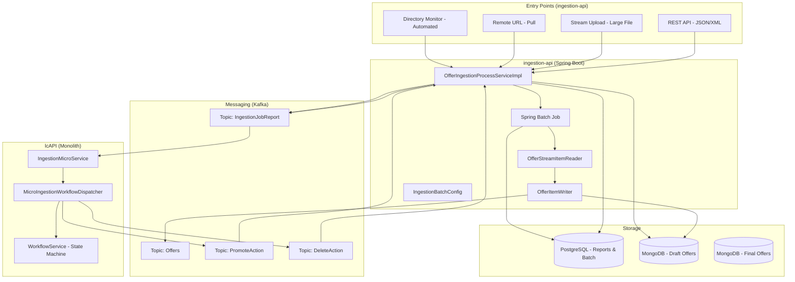

---

## 4. Ingestion Modes

### 4.1 REST API (Small to Medium Batches)

**Use case**: Internal systems or partners submitting structured data via API.

**Characteristics**:
- Accepts JSON/XML, typically up to 1,000 records.
- Immediate payload validation.
- Synchronous processing via `processOffers()`, sending each offer to Kafka.
- Immediate acknowledgment with a report identifier.

**Flow**:
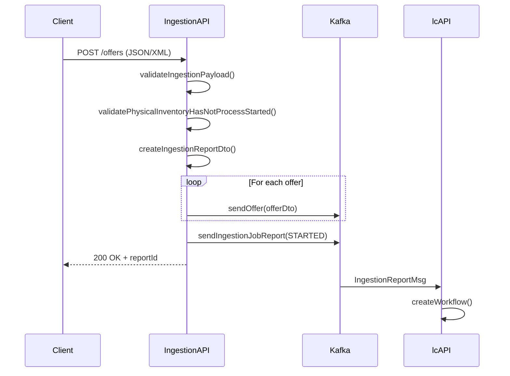

---

### 4.2 Stream Upload (Large Files)

**Use case**: Files of any size (tested up to 2 GB+) without loading the entire file into memory.

**Characteristics**:
- Processed via **Spring Batch** with `OfferStreamItemReader` and `OfferItemWriter`.
- Configurable chunk size (`ingestion.batch.chunk-size`, default 10).
- Configurable skip limit (`ingestion.batch.skip-limit`, default 2 in current config).
- Constant memory usage regardless of file size.
- Processed on a **virtual thread** (`Thread.ofVirtual()`) to avoid blocking the main thread.

**Flow**:
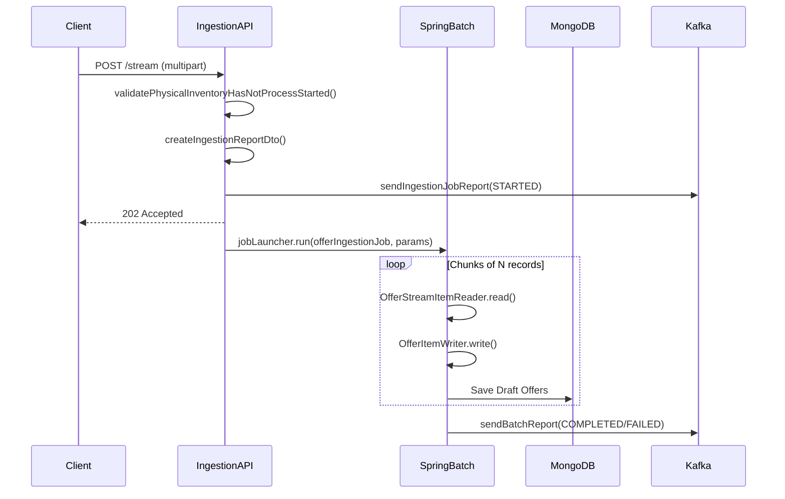

---

### 4.3 Remote URL (Pull Model)

**Use case**: Files hosted on partner systems or cloud storage.

**Characteristics**:
- The system downloads the file from the provided URL using `HttpClient` with automatic redirect following.
- Connection timeout: 10 seconds; download timeout: 5 minutes.
- Processed on a virtual thread to avoid blocking the server.
- Once downloaded, reuses the same stream pipeline (`processOffersStream`).

**Flow**:
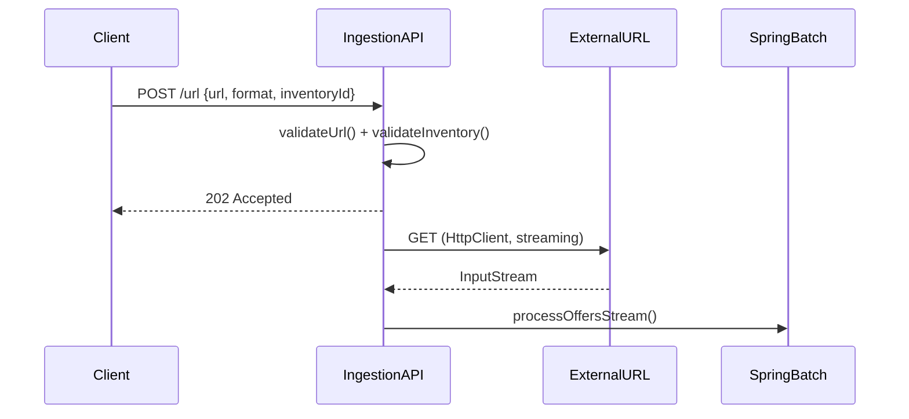

---

### 4.4 Directory Monitor (Automated)

**Use case**: Automatic processing of files deposited in monitored folders.

**Characteristics**:
- Automatically detects new files.
- Supports network paths and SFTP locations.
- Archives or deletes files after processing.

---

## 5. Asynchronous Processing Pipeline (Spring Batch)

### 5.1 Job Configuration (`IngestionBatchConfig`)

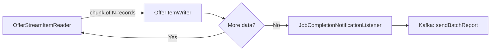

### 5.2 Retry Strategy

The ingestion step implements a layered fault-tolerance policy:

| Layer | Mechanism | Configuration |
|-------|-----------|---------------|
| **Retry** | Retries infrastructure errors (Kafka, DB) | 3 attempts, exponential backoff (2s, 4s, 8s) |
| **Skip** | Skips records with data conversion errors | Up to `skip-limit` records |
| **Fail** | Stops the entire Job | Critical infrastructure errors or skip-limit exceeded |

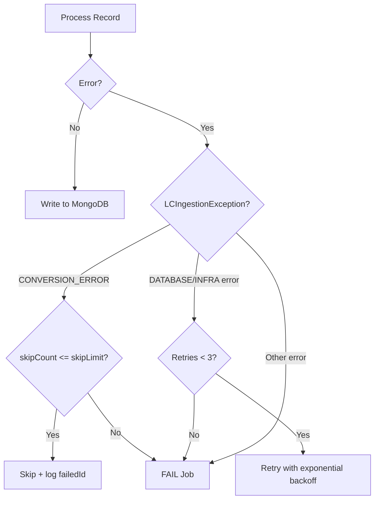

### 5.3 Configuration Parameters (application.yml)

```yaml
ingestion:
  batch:
    chunk-size: 10       # Records per chunk
    skip-limit: 2        # Max skipped records before failing the Job
```

---

## 6. Interaction with the lcAPI Monolith — State Machine

### 6.1 Workflow Overview (`MICRO_ING_SM`)

The `lcAPI` monolith orchestrates the lifecycle of each ingestion through a state machine managed by `MicroIngestionWorkflowDispatcher`. Each ingestion report has its own workflow instance.

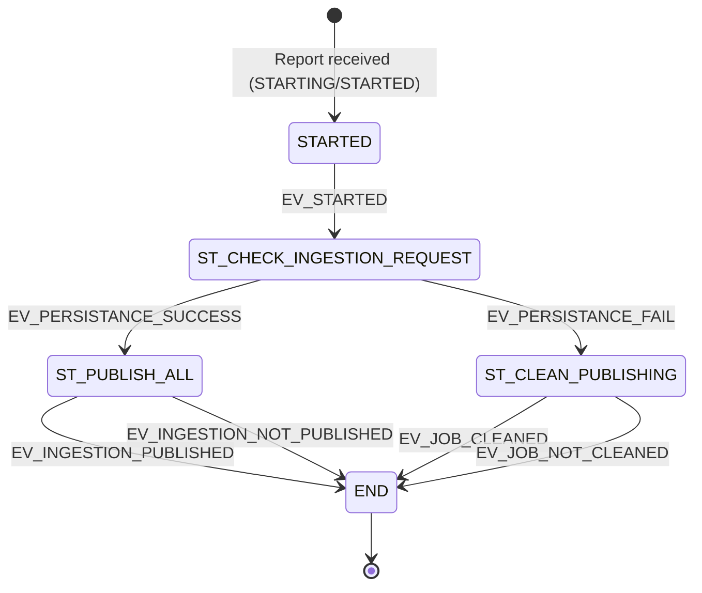

### 6.2 State Descriptions

| State | Responsibility |
|-------|----------------|
| `STARTED` | Initial state. Receives the ingestion token (`VAR_INGESTION_TOKEN`) and fires `EV_STARTED`. |
| `ST_CHECK_INGESTION_REQUEST` | Validates that all offers have been persisted in MongoDB. Waits for success or failure signal. |
| `ST_PUBLISH_ALL` | Publishes the offers: sends a Kafka **promote** event (`sendPromoteAction`). Transitions to END. |
| `ST_CLEAN_PUBLISHING` | Aborts the ingestion: sends a Kafka **delete** event (`sendDeleteAction`). Transitions to END. |
| `END` | Terminal state. No further actions. |

### 6.3 Complete Messaging Flow Between ingestion-api and lcAPI

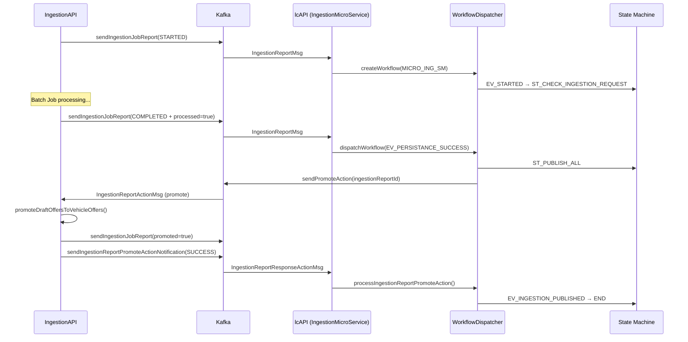

### 6.4 Error and Cleanup Flow

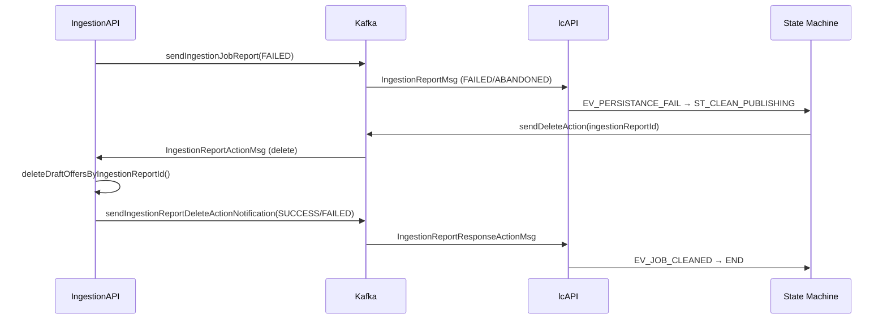

---

## 7. Synchronization and Schedulers

The system includes schedulers to guarantee consistency between the database and the actual state of jobs:

| Scheduler | Cron | Lock | Purpose |
|-----------|------|------|---------|
| `syncPendingBatchReports` | Every 30 seconds | `IngestionBatchReportsSync_Lock` (4m/1m) | Checks pending batch reports and processes them when MongoDB count matches |
| `syncPendingReports` | Every 30 seconds | `IngestionReportsSync_Lock` (4m/1m) | Same for PROCESS-type ingestion reports (API) |
| `purgeScheduler` | Sundays at 3 AM | — | Purges old records (> 7 days) |

Locks are managed with **ShedLock** to ensure only one replica executes each scheduler in multi-instance environments.

---

## 8. Data Model and Storage

### 8.1 Multi-Storage Strategy

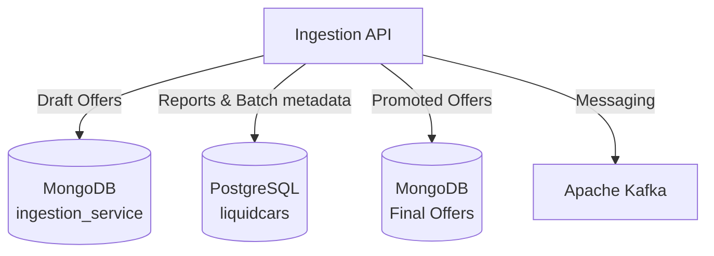

| Store | Purpose | Collection/Table |
|-------|---------|-----------------|
| **MongoDB** | Draft offers awaiting promotion, flexible schema | `draft_offers` |
| **PostgreSQL** | Ingestion reporting, Spring Batch metadata | `ingestion_reports`, `BATCH_*` |
| **MongoDB** | Final promoted offers, source of truth for queries | `offers` |

### 8.2 Upsert Logic and Deduplication

- Unique offer identifier (`externalPublicationId`) to prevent duplicates.
- Multiple ingestions of the same data result in updates, not duplicates.
- `DumpType` determines whether the ingestion is incremental or a full dump.

### 8.3 Promoting Drafts to Active Offers

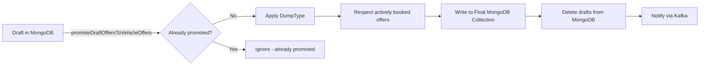

---

## 9. Error Handling and Recovery

### 9.1 Fault Tolerance Strategies

**Invalid record (data error)**
- The record is skipped and its identifier is logged (`failedExternalIds`).
- Processing continues with the remaining records.
- Failed IDs are included in the final report.

**Infrastructure error (Kafka, DB)**
- Automatic retry (3 attempts, exponential backoff: 2s → 4s → 8s).
- If the error persists, the Job fails completely and the cleanup flow is triggered.

**Skip-limit exceeded**
- If more than `skip-limit` records are skipped, the Job fails.
- The cleanup flow is triggered via Kafka → lcAPI → `ST_CLEAN_PUBLISHING`.

### 9.2 Concurrency Validation

Before starting any ingestion, the system verifies that no active process already exists for the same inventory:

```java
// Final statuses that allow a new ingestion
List<IngestionBatchStatus> finalStatuses = List.of(
                COMPLETED, FAILED, ABANDONED, STOPPED
        );
// If a report exists in a non-final status → exception
```

---

## 10. Security

### 10.1 Authentication and Authorization

- All endpoints require JWT authentication via **Keycloak** (`security.security-profile-issuer`).
- Role-based authorization using `@LCFunctionalContext` annotations.
- Partners can only access their own data; admins have cross-partner visibility.

### 10.2 Request Size Limits

- Batch and URL endpoints have a configurable size restriction (`max-batch-size`, default 10 MB).
- Affected paths: `/batch`, `/url`.
- Multipart with no limit (`max-file-size: -1`) for large stream uploads.

### 10.3 Data in Transit and at Rest

- Encrypted communications in transit (HTTPS + Kafka with TLS).
- Credentials externalized via environment variables (`SPRING_DATA_MONGODB_URI`, `SPRING_DATASOURCE_URL`, `KAFKA_BOOTSTRAP_SERVERS`).

---

## 11. Observability

### 11.1 Monitoring Endpoints

Actuator exposed at:
- `/actuator/health` — Liveness and Readiness probes (Kubernetes-ready).
- `/actuator/metrics` — JVM and application metrics.
- `/actuator/prometheus` — Prometheus format for scraping.

### 11.2 Logging

| Component | Default Level |
|-----------|---------------|
| Spring Batch | INFO |
| Kafka | WARN |
| Hibernate SQL | WARN |
| Liquibase | INFO |
| Application (`com.orbyn.ingestion`) | WARN |

### 11.3 API Documentation

Swagger UI available at `/swagger-ui.html`, with the OpenAPI specification loaded from `/api/ingestion-api.yml`.

---

## 12. REST API Endpoints

All endpoints are secured with JWT (Keycloak). Two roles are defined:
- `LCSupport_role` — Support and administration.
- `M2M_role` — Automated machine-to-machine integrations.

### 12.1 Ingestion Endpoints

| Method | Path | Roles | Description |
|--------|------|-------|-------------|
| `POST` | `/v1/ingestion/batch` | `LCSupport_role`, `M2M_role` | Submits a structured JSON payload (up to ~1,000 offers) for synchronous queuing. Accepts `IngestionPayload` with an `offers` array and an optional `offersToDelete` list of external IDs. Returns `202 Accepted`. |
| `POST` | `/v1/ingestion/stream` | `LCSupport_role`, `M2M_role` | Uploads a large binary file (`application/octet-stream`) of any size. The file is processed incrementally via Spring Batch without loading it into memory. Format (`xml`/`json`) is specified as a query parameter. Returns `202 Accepted`. |
| `POST` | `/v1/ingestion/url` | `LCSupport_role`, `M2M_role` | Triggers a pull ingestion from a remote URL. The system downloads and streams the file directly from the provided URI. Useful when partners cannot push data. Returns `202 Accepted`. |

**Common query parameters for ingestion endpoints:**

| Parameter | Type | Required | Description |
|-----------|------|----------|-------------|
| `inventoryId` | UUID | Yes | Target physical inventory identifier |
| `dumpType` | `INCREMENTAL` / `REPLACEMENT` | Yes | Whether the ingestion adds/updates records or fully replaces the inventory |
| `format` | `xml` / `json` | Yes (stream, url) | File format of the ingested data |
| `publicationDate` | datetime | No | Date to associate with the publication |
| `externalPublicationId` | string | No | External reference ID for traceability |

### 12.2 Management Endpoints

| Method | Path | Roles | Description |
|--------|------|-------|-------------|
| `GET` | `/v1/ingestion/reports` | `LCSupport_role`, `M2M_role` | Returns a paginated list of ingestion reports with rich filtering options (see below). |
| `GET` | `/v1/ingestion/reports/{ingestionReportId}` | `LCSupport_role`, `M2M_role` | Returns the full detail of a single ingestion report by its UUID, including counters, status, failed IDs, and promotion state. |
| `POST` | `/v1/ingestion/promote/{ingestionReportId}` | `LCSupport_role` | Manually triggers the promotion of draft offers (MongoDB draft collection → MongoDB final collection) for a given report. Normally triggered automatically by the workflow. |
| `DELETE` | `/v1/ingestion/draft/{ingestionReportId}` | `LCSupport_role` | Deletes all draft offers in the temporary MongoDB collection associated with a report. Used for cleanup after a failed or aborted ingestion. Returns `204 No Content`. |

**Available filters for `GET /v1/ingestion/reports`:**

| Filter | Type               | Description |
|--------|--------------------|-------------|
| `page` / `size` | integer            | Pagination (default: page 0, size 20) |
| `sortBy` / `sortDirection` | enum               | Sort field and direction (`ASC`/`DESC`) |
| `processType` | `FILE` / `PROCESS` | Whether the ingestion came from a file stream or a direct API call |
| `status` | enum               | `COMPLETED`, `STARTED`, `FAILED`, `ABANDONED`, etc. |
| `dumpType` | enum               | `INCREMENTAL` / `REPLACEMENT` |
| `inventoryId` | UUID               | Filter by inventory |
| `requesterParticipantId` | UUID               | Filter by the requesting participant |
| `externalRequestId` | string             | Filter by external reference |
| `processed` / `promoted` | boolean            | Whether offers have been fully processed or promoted |
| `createdFrom` / `createdTo` | datetime           | Creation date range |
| `updatedFrom` / `updatedTo` | datetime           | Last update date range |

### 12.3 IngestionReport Response Object

| Field | Type | Description |
|-------|------|-------------|
| `id` | UUID | Unique report identifier |
| `processType` | `FILE` / `PROCESS` | Ingestion origin type |
| `batchJobId` | UUID | Spring Batch job ID (only for FILE type) |
| `requesterParticipantId` | UUID | Participant who triggered the ingestion |
| `inventoryId` | UUID | Target inventory |
| `externalRequestId` | string | External reference for traceability |
| `publicationDate` | datetime | Associated publication date |
| `status` | enum | Current lifecycle status |
| `dumpType` | enum | `INCREMENTAL` or `REPLACEMENT` |
| `readCount` | integer | Total records read from the source |
| `writeCount` | integer | Records successfully written |
| `skipCount` | integer | Records skipped due to data errors |
| `failedExternalIds` | array | External IDs of records that failed processing |
| `idsForDelete` | array | External IDs requested for deletion |
| `activeBookedOfferIds` | array | Offer IDs preserved during promotion due to active bookings |
| `processed` | boolean | Whether all written offers have been confirmed in MongoDB |
| `promoted` | boolean | Whether draft offers have been promoted to the final collection |
| `createdAt` / `updatedAt` | datetime | Audit timestamps |

---

## 13. Kafka Topics and Messages

The ingestion system uses Kafka as its primary integration bus between `ingestion-api` and `lcAPI`. Below are all topics, their direction, and the structure of the messages exchanged.

### 13.1 Topic Overview

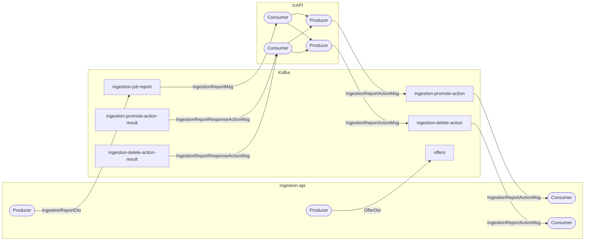

### 13.2 Topic: `offers`

**Direction**: `ingestion-api` → downstream consumers
**Producer**: `IOfferInfraKafkaProducerService.sendOffer()`
**Trigger**: Each individual offer processed during a batch API ingestion (`processOffers()`).

| Field | Type | Description |
|-------|------|-------------|
| `id` | UUID | Offer identifier |
| `ingestionReportId` | UUID | Associated ingestion report |
| `externalIdInfo` | object | `ownerReference`, `dealerReference`, `channelReference` |
| `vehicleInstance` | object | Full vehicle data (model, plate, mileage, equipment, etc.) |
| `price` / `financedPrice` | Money | Pricing information (`amount` + `currency`) |
| `sellerType` | enum | `usedCar_ProfessionalSeller` / `usedCar_PrivateSeller` |
| `resources` | array | Images and media resources |
| `pickUpAddress` | object | Pickup location with GPS coordinates |

---

### 13.3 Topic: `ingestion-job-report`

**Direction**: `ingestion-api` → `lcAPI`
**Producer**: `IOfferInfraKafkaProducerService.sendIngestionJobReport()`
**Consumer**: `IngestionMicroService.processIngestionReport()` in `lcAPI`
**Trigger**: Published at key lifecycle moments — job start, completion, failure, and after promotion.

| Field | Type | Description |
|-------|------|-------------|
| `id` | UUID | Ingestion report ID |
| `status` | enum | `STARTING`, `STARTED`, `COMPLETED`, `FAILED`, `ABANDONED`, `STOPPED` |
| `processType` | enum | `FILE` or `PROCESS` |
| `batchJobId` | UUID | Spring Batch job reference |
| `inventoryId` | UUID | Target inventory |
| `requesterParticipantId` | UUID | Who triggered the ingestion |
| `dumpType` | enum | `INCREMENTAL` or `REPLACEMENT` |
| `readCount` | integer | Records read |
| `writeCount` | integer | Records written |
| `skipCount` | integer | Records skipped |
| `processed` | boolean | All offers confirmed in MongoDB |
| `promoted` | boolean | Offers promoted to final collection |
| `failedExternalIds` | array | Failed record identifiers |
| `idsForDelete` | array | IDs requested for deletion |
| `publicationDate` | datetime | Associated publication date |

**Behaviour in `lcAPI` based on `status`:**

| Status received | Action |
|----------------|--------|
| `STARTING` / `STARTED` | Creates a new `MICRO_ING_SM` workflow instance |
| `COMPLETED` + `processed=true` + `promoted=false` | Fires `EV_PERSISTANCE_SUCCESS` → triggers promotion |
| `FAILED` / `ABANDONED` | Fires `EV_PERSISTANCE_FAIL` → triggers cleanup |
| `STOPPING` / `STOPPED` | No action |

---

### 13.4 Topic: `ingestion-promote-action`

**Direction**: `lcAPI` → `ingestion-api`
**Producer**: `IngestionReportPromoteActionResultInfraKafkaProducer.sendPromoteAction()` (fired from `ST_PUBLISH_ALL` state)
**Consumer**: `ingestion-api` — triggers `promoteDraftOffersToVehicleOffers()`

| Field | Type | Description |
|-------|------|-------------|
| `ingestionReportId` | UUID | Report whose drafts must be promoted |

Upon receiving this message, `ingestion-api`:
1. Loads the associated `IngestionReportDto`.
2. Fetches active booked offer IDs to preserve them during the promotion.
3. Moves draft offers from the temporary MongoDB collection to the final collection, applying `DumpType` logic.
4. Deletes the draft offers from the temporary collection.
5. Publishes the result to `ingestion-promote-action-result`.

---

### 13.5 Topic: `ingestion-delete-action`

**Direction**: `lcAPI` → `ingestion-api`
**Producer**: `IngestionReportDeleteActionResultInfraKafkaProducer.sendDeleteAction()` (fired from `ST_CLEAN_PUBLISHING` state)
**Consumer**: `ingestion-api` — triggers `deleteDraftOffersByIngestionReportId()`

| Field | Type | Description |
|-------|------|-------------|
| `ingestionReportId` | UUID | Report whose drafts must be deleted |

Upon receiving this message, `ingestion-api` deletes all draft offers associated with the report from the temporary MongoDB collection and publishes the result to `ingestion-delete-action-result`.

---

### 13.6 Topic: `ingestion-promote-action-result`

**Direction**: `ingestion-api` → `lcAPI`
**Producer**: `IOfferInfraKafkaProducerService.sendIngestionReportPromoteActionNotification()`
**Consumer**: `IngestionMicroService.processIngestionReportPromoteAction()` in `lcAPI`

| Field | Type | Description |
|-------|------|-------------|
| `ingestionReportId` | UUID | Report identifier |
| `result` | enum | `SUCCESS` or `FAILED` |
| `techCause` | enum | Technical error cause (only on failure) |
| `errorMsg` | string | Error description (only on failure) |

| Result | Workflow event fired |
|--------|---------------------|
| `SUCCESS` | `EV_INGESTION_PUBLISHED` → END |
| `FAILED` | `EV_INGESTION_NOT_PUBLISHED` → END |

---

### 13.7 Topic: `ingestion-delete-action-result`

**Direction**: `ingestion-api` → `lcAPI`
**Producer**: `IOfferInfraKafkaProducerService.sendIngestionReportDeleteActionNotification()`
**Consumer**: `IngestionMicroService.processIngestionReportDeleteAction()` in `lcAPI`

| Field | Type | Description |
|-------|------|-------------|
| `ingestionReportId` | UUID | Report identifier |
| `result` | enum | `SUCCESS` or `FAILED` |
| `techCause` | enum | Technical error cause (only on failure) |
| `errorMsg` | string | Error description (only on failure) |

| Result | Workflow event fired |
|--------|---------------------|
| `SUCCESS` | `EV_JOB_CLEANED` → END |
| `FAILED` | `EV_JOB_NOT_CLEANED` → END |

---

### 13.8 Kafka Producer Configuration

| Parameter | Value | Rationale |
|-----------|-------|-----------|
| `acks` | `all` | Maximum durability — waits for full replication before confirming |
| `retries` | `3` | Automatic retry on transient producer errors |
| `linger.ms` | `0` | Immediate send — no batching delay |
| `delivery.timeout.ms` | `120,000 ms` | 2-minute total delivery window |
| `request.timeout.ms` | `30,000 ms` | 30-second per-request timeout |
| `max.block.ms` | `6,000 ms` | Max time to block when the send buffer is full |

### 13.9 Kafka Consumer Configuration

| Parameter | Value | Description |
|-----------|-------|-------------|
| `group-id` | `liquidcars-ingestion-group` | Consumer group for the ingestion service |
| `auto-offset-reset` | `earliest` | Reads from the beginning if no offset is stored |
| `enable-auto-commit` | `false` | Manual acknowledgment per record (`ack-mode: record`) |
| `max-attempts` | `5` | Retry attempts on consumer-side processing failure |
| `initial-interval` | `5,000 ms` | Wait before first retry |
| `multiplier` | `2.0` | Doubles the wait on each retry (5s → 10s → 20s → 30s) |
| `max-interval` | `30,000 ms` | Maximum wait cap between retries |

---

## 14. Expected Performance

| Scenario | Volume | Estimated Time | Memory |
|----------|--------|----------------|--------|
| Small API batch | 1,000 records | < 30 seconds | Minimal |
| Medium upload | 10,000 records | 2–5 minutes | ~256 MB |
| Large stream | 100,000 records | 15–25 minutes | ~256 MB |
| Massive bulk load | 170,000 records | 25–40 minutes | ~256 MB |

**Horizontal scaling**: adding Spring Batch workers reduces processing time linearly:
- 2 workers → 170,000 records in ~30 min
- 4 workers → ~15 min
- 8 workers → ~8 min

---

## 15. Infrastructure Configuration (application.yml)

### 15.1 Key Configuration Summary

| Section | Key Parameter | Default Value |
|---------|--------------|---------------|
| Server | `server.port` | 8890 |
| Multipart | `max-file-size` | Unlimited (-1) |
| Batch chunk | `ingestion.batch.chunk-size` | 10 |
| Batch skip | `ingestion.batch.skip-limit` | 2 |
| Kafka producer acks | `acks` | all (maximum durability) |
| Kafka consumer retries | `max-attempts` | 5 |
| HikariCP pool | `maximum-pool-size` | 10 |
| Purge scheduler | Cron | Sundays at 3 AM |
| Sync scheduler | Cron | Every 30 seconds |

---

## 16. Success Criteria

The system will be considered successful when:

- ✅ Imports of 170,000+ records complete without system restart
- ✅ Memory usage remains constant regardless of file size
- ✅ Failed jobs can be resumed without reprocessing already completed data
- ✅ 99.9% of valid records are processed successfully
- ✅ The lcAPI workflow reflects the correct state at each phase
- ✅ Zero data loss during the ingestion process
- ✅ Complete visibility of all ingestion operations via Kafka + PostgreSQL

---

## 17. Glossary

| Term | Definition |
|------|-----------|
| **Draft Offer** | Offer persisted in the temporary MongoDB collection awaiting promotion |
| **Promoted Offer** | Offer written to the final MongoDB collection, accessible by the platform |
| **DumpType** | Ingestion type: `INCREMENTAL` (adds/updates) or `REPLACEMENT` (replaces everything) |
| **Chunk** | Subset of records processed together as an atomic unit |
| **Skip** | Record omitted due to a non-critical data error |
| **Workflow (MICRO_ING_SM)** | State machine in lcAPI that orchestrates the lifecycle of each ingestion |
| **ShedLock** | Distributed locking mechanism for schedulers in multi-replica environments |
| **Upsert** | Operation that updates if a record exists or inserts it if it does not |
| **VAR_INGESTION_TOKEN** | Workflow variable referencing the ingestion report ID |