# Functional Specification: Offer Ingestion System (Updated)

## 1. Executive Summary

This document describes the architecture and functional requirements of the vehicle offer ingestion system (`ingestion-api`). The system is designed to process large volumes of data (170,000+ records) asynchronously, in a decoupled manner, and without impacting the availability of the main system (`lcAPI`).

The solution combines an **independent ingestion API** (`ingestion-api`, Spring Boot) with an **orchestrating monolith** (`lcAPI`) that manages the complete lifecycle through a **state machine (Workflow)**, with both systems communicating via **Apache Kafka**.

---

## 2. Business Objectives

### 2.1 Primary Goals

- **Eliminate downtime**: bulk imports without restarting the system or opening maintenance windows.
- **Scale to volume**: process from hundreds to hundreds of thousands of records efficiently.
- **Guarantee data integrity**: lifecycle controlled with auditable states and fault recovery.
- **Operational visibility**: real-time monitoring of every ingestion's status.

### 2.2 KPIs

| Indicator | Target |
|-----------|--------|
| Throughput | 170,000+ offers without degradation |
| Memory | Constant (~256 MB) regardless of file size |
| Fault tolerance | Continued processing despite individual record errors |
| Recovery | Resume from last checkpoint without duplicates |

---

## 3. System Architecture Overview

The system is composed of two main applications and a messaging layer:

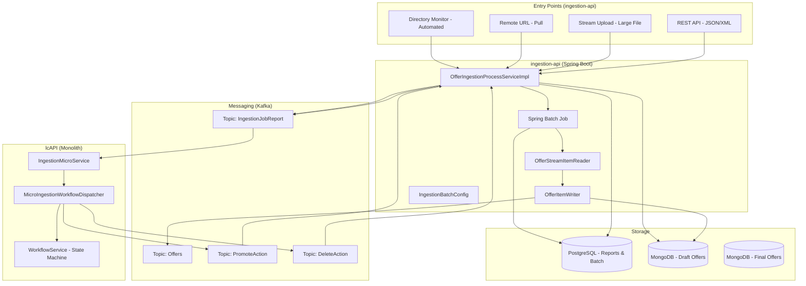

---

## 4. Ingestion Modes

### 4.1 REST API (Small to Medium Batches)

**Use case**: Internal systems or partners submitting structured data via API.

**Characteristics**:
- Accepts JSON/XML, typically up to 1,000 records.
- Immediate payload validation.
- Synchronous processing via `processOffers()`, sending each offer to Kafka.
- Immediate acknowledgment with a report identifier.

**Flow**:
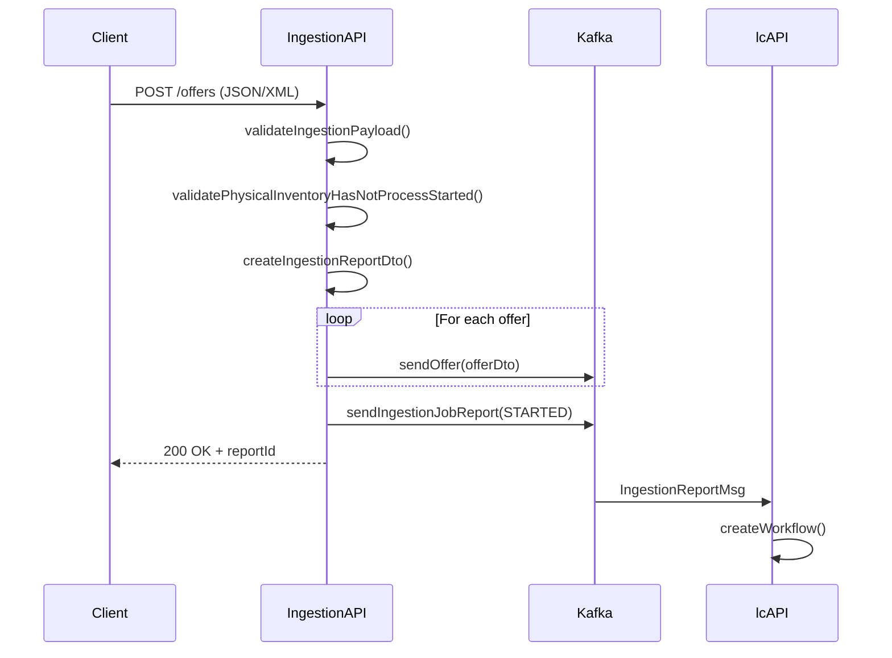

---

### 4.2 Stream Upload (Large Files)

**Use case**: Files of any size (tested up to 2 GB+) without loading the entire file into memory.

**Characteristics**:
- Processed via **Spring Batch** with `OfferStreamItemReader` and `OfferItemWriter`.
- Configurable chunk size (`ingestion.batch.chunk-size`, default 10).
- Configurable skip limit (`ingestion.batch.skip-limit`, default 2 in current config).
- Constant memory usage regardless of file size.
- Processed on a **virtual thread** (`Thread.ofVirtual()`) to avoid blocking the main thread.

**Flow**:
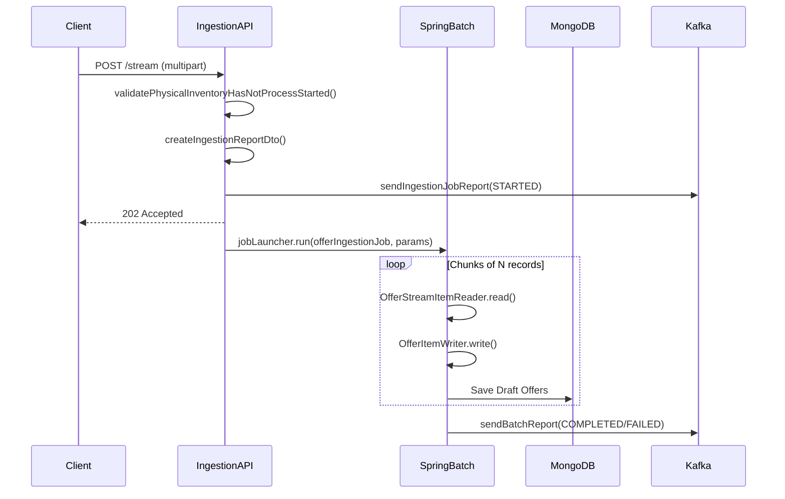

---

### 4.3 Remote URL (Pull Model)

**Use case**: Files hosted on partner systems or cloud storage.

**Characteristics**:
- The system downloads the file from the provided URL using `HttpClient` with automatic redirect following.
- Connection timeout: 10 seconds; download timeout: 5 minutes.
- Processed on a virtual thread to avoid blocking the server.
- Once downloaded, reuses the same stream pipeline (`processOffersStream`).

**Flow**:
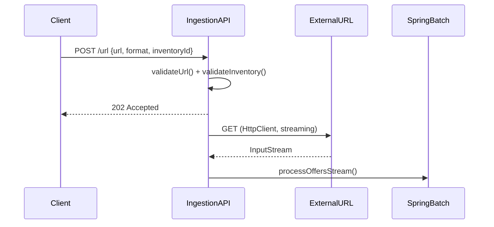

---

### 4.4 Directory Monitor (Automated)

**Use case**: Automatic processing of files deposited in monitored folders.

**Characteristics**:
- Automatically detects new files.
- Supports network paths and SFTP locations.
- Archives or deletes files after processing.

---

## 5. Asynchronous Processing Pipeline (Spring Batch)

### 5.1 Job Configuration (`IngestionBatchConfig`)

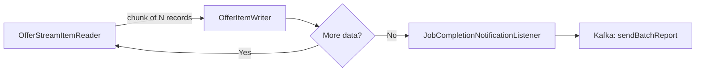

### 5.2 Retry Strategy

The ingestion step implements a layered fault-tolerance policy:

| Layer | Mechanism | Configuration |
|-------|-----------|---------------|
| **Retry** | Retries infrastructure errors (Kafka, DB) | 3 attempts, exponential backoff (2s, 4s, 8s) |
| **Skip** | Skips records with data conversion errors | Up to `skip-limit` records |
| **Fail** | Stops the entire Job | Critical infrastructure errors or skip-limit exceeded |

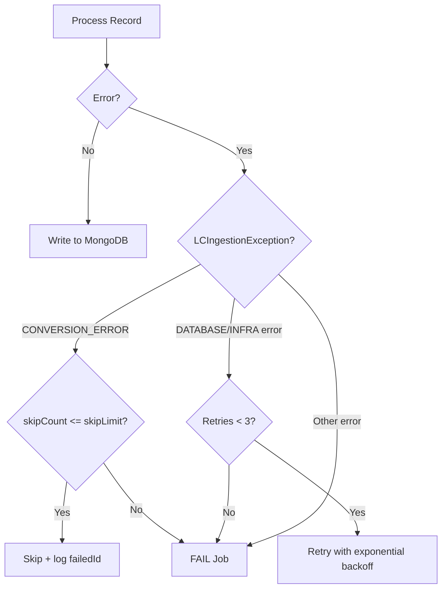

### 5.3 Configuration Parameters (application.yml)

```yaml
ingestion:
  batch:
    chunk-size: 10       # Records per chunk
    skip-limit: 2        # Max skipped records before failing the Job
```

---

## 6. Interaction with the lcAPI Monolith — State Machine

### 6.1 Workflow Overview (`MICRO_ING_SM`)

The `lcAPI` monolith orchestrates the lifecycle of each ingestion through a state machine managed by `MicroIngestionWorkflowDispatcher`. Each ingestion report has its own workflow instance.

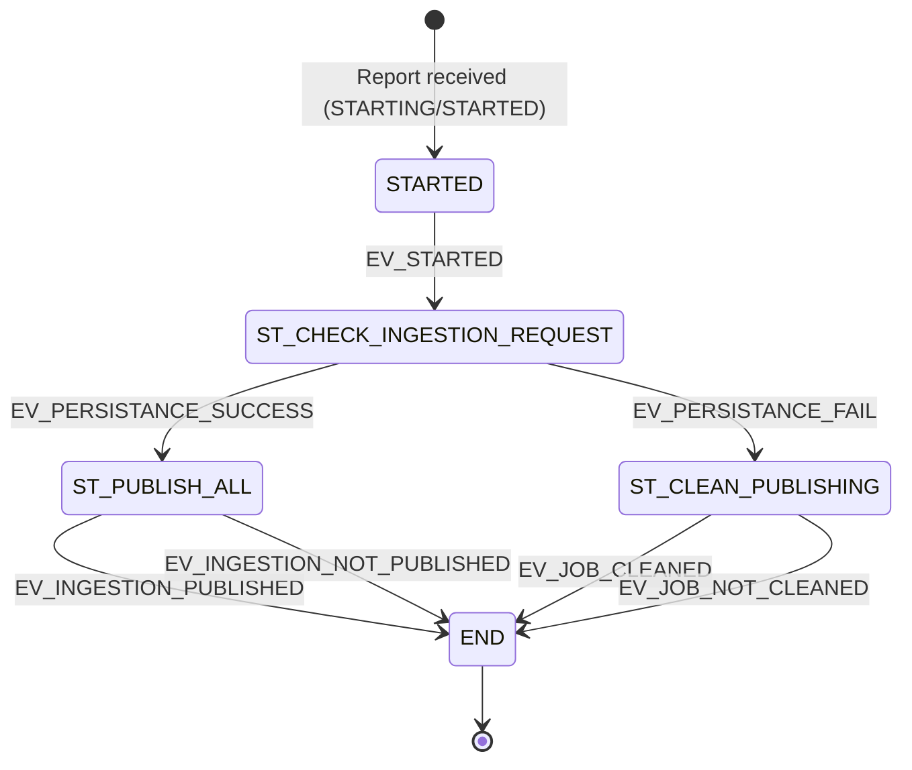

### 6.2 State Descriptions

| State | Responsibility |
|-------|----------------|
| `STARTED` | Initial state. Receives the ingestion token (`VAR_INGESTION_TOKEN`) and fires `EV_STARTED`. |
| `ST_CHECK_INGESTION_REQUEST` | Validates that all offers have been persisted in MongoDB. Waits for success or failure signal. |
| `ST_PUBLISH_ALL` | Publishes the offers: sends a Kafka **promote** event (`sendPromoteAction`). Transitions to END. |
| `ST_CLEAN_PUBLISHING` | Aborts the ingestion: sends a Kafka **delete** event (`sendDeleteAction`). Transitions to END. |
| `END` | Terminal state. No further actions. |

### 6.3 Complete Messaging Flow Between ingestion-api and lcAPI

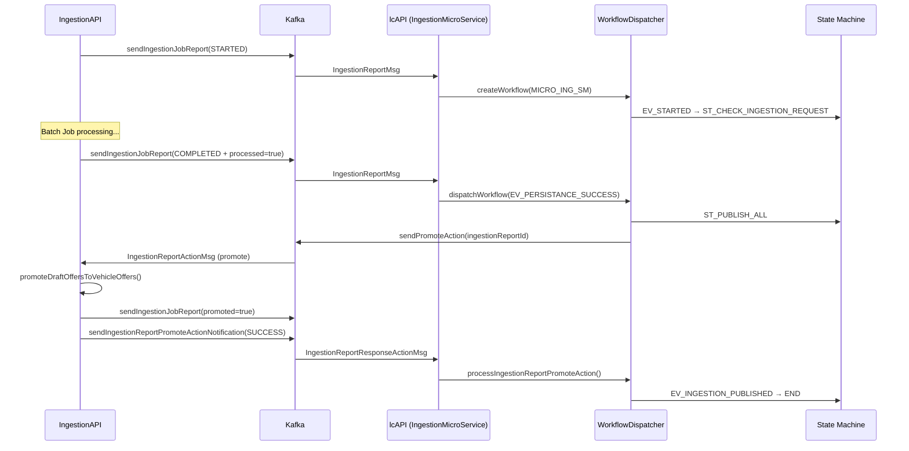

### 6.4 Error and Cleanup Flow

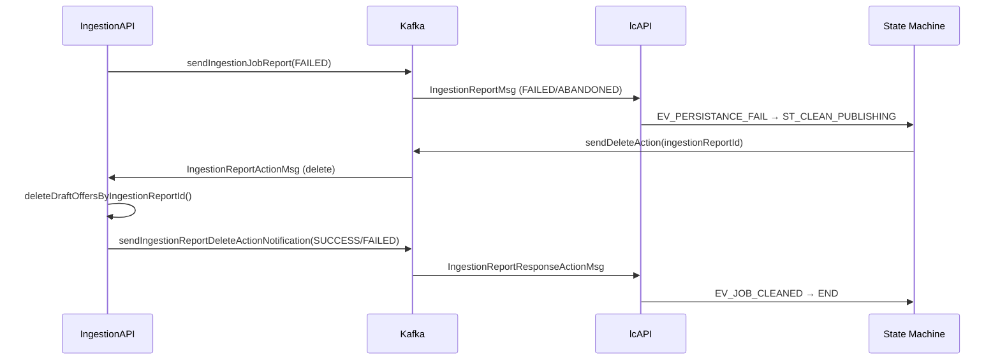

---

## 7. Synchronization and Schedulers

The system includes schedulers to guarantee consistency between the database and the actual state of jobs:

| Scheduler | Cron | Lock | Purpose |
|-----------|------|------|---------|
| `syncPendingBatchReports` | Every 30 seconds | `IngestionBatchReportsSync_Lock` (4m/1m) | Checks pending batch reports and processes them when MongoDB count matches |
| `syncPendingReports` | Every 30 seconds | `IngestionReportsSync_Lock` (4m/1m) | Same for PROCESS-type ingestion reports (API) |
| `purgeScheduler` | Sundays at 3 AM | — | Purges old records (> 7 days) |

Locks are managed with **ShedLock** to ensure only one replica executes each scheduler in multi-instance environments.

---

## 8. Data Model and Storage

### 8.1 Multi-Storage Strategy

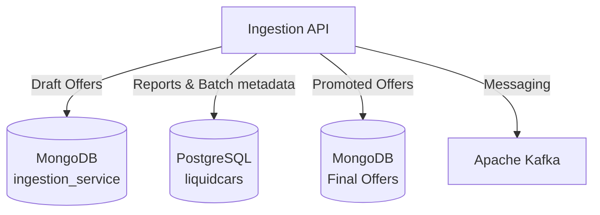

| Store | Purpose | Collection/Table |
|-------|---------|-----------------|
| **MongoDB** | Draft offers awaiting promotion, flexible schema | `draft_offers` |
| **PostgreSQL** | Ingestion reporting, Spring Batch metadata | `ingestion_reports`, `BATCH_*` |
| **MongoDB** | Final promoted offers, source of truth for queries | `offers` |

### 8.2 Upsert Logic and Deduplication

- Unique offer identifier (`externalPublicationId`) to prevent duplicates.
- Multiple ingestions of the same data result in updates, not duplicates.
- `DumpType` determines whether the ingestion is incremental or a full dump.

### 8.3 Promoting Drafts to Active Offers

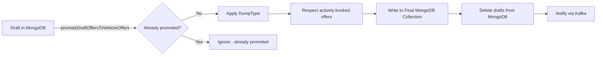

---

## 9. Error Handling and Recovery

### 9.1 Fault Tolerance Strategies

**Invalid record (data error)**
- The record is skipped and its identifier is logged (`failedExternalIds`).
- Processing continues with the remaining records.
- Failed IDs are included in the final report.

**Infrastructure error (Kafka, DB)**
- Automatic retry (3 attempts, exponential backoff: 2s → 4s → 8s).
- If the error persists, the Job fails completely and the cleanup flow is triggered.

**Skip-limit exceeded**
- If more than `skip-limit` records are skipped, the Job fails.
- The cleanup flow is triggered via Kafka → lcAPI → `ST_CLEAN_PUBLISHING`.

### 9.2 Concurrency Validation

Before starting any ingestion, the system verifies that no active process already exists for the same inventory:

```java
// Final statuses that allow a new ingestion
List<IngestionBatchStatus> finalStatuses = List.of(
    COMPLETED, FAILED, ABANDONED, STOPPED
);
// If a report exists in a non-final status → exception
```

---

## 10. Security

### 10.1 Authentication and Authorization

- All endpoints require JWT authentication via **Keycloak** (`security.security-profile-issuer`).
- Role-based authorization using `@LCFunctionalContext` annotations.
- Partners can only access their own data; admins have cross-partner visibility.

### 10.2 Request Size Limits

- Batch and URL endpoints have a configurable size restriction (`max-batch-size`, default 10 MB).
- Affected paths: `/batch`, `/url`.
- Multipart with no limit (`max-file-size: -1`) for large stream uploads.

### 10.3 Data in Transit and at Rest

- Encrypted communications in transit (HTTPS + Kafka with TLS).
- Credentials externalized via environment variables (`SPRING_DATA_MONGODB_URI`, `SPRING_DATASOURCE_URL`, `KAFKA_BOOTSTRAP_SERVERS`).

---

## 11. Observability

### 11.1 Monitoring Endpoints

Actuator exposed at:
- `/actuator/health` — Liveness and Readiness probes (Kubernetes-ready).
- `/actuator/metrics` — JVM and application metrics.
- `/actuator/prometheus` — Prometheus format for scraping.

### 11.2 Logging

| Component | Default Level |
|-----------|---------------|
| Spring Batch | INFO |
| Kafka | WARN |
| Hibernate SQL | WARN |
| Liquibase | INFO |
| Application (`com.orbyn.ingestion`) | WARN |

### 11.3 API Documentation

Swagger UI available at `/swagger-ui.html`, with the OpenAPI specification loaded from `/api/ingestion-api.yml`.

---

## 12. Expected Performance

| Scenario | Volume | Estimated Time | Memory |
|----------|--------|----------------|--------|
| Small API batch | 1,000 records | < 30 seconds | Minimal |
| Medium upload | 10,000 records | 2–5 minutes | ~256 MB |
| Large stream | 100,000 records | 15–25 minutes | ~256 MB |
| Massive bulk load | 170,000 records | 25–40 minutes | ~256 MB |

**Horizontal scaling**: adding Spring Batch workers reduces processing time linearly:
- 2 workers → 170,000 records in ~30 min
- 4 workers → ~15 min
- 8 workers → ~8 min

---

## 13. Infrastructure Configuration (application.yml)

### 13.1 Key Configuration Summary

| Section | Key Parameter | Default Value |
|---------|--------------|---------------|
| Server | `server.port` | 8890 |
| Multipart | `max-file-size` | Unlimited (-1) |
| Batch chunk | `ingestion.batch.chunk-size` | 10 |
| Batch skip | `ingestion.batch.skip-limit` | 2 |
| Kafka producer acks | `acks` | all (maximum durability) |
| Kafka consumer retries | `max-attempts` | 5 |
| HikariCP pool | `maximum-pool-size` | 10 |
| Purge scheduler | Cron | Sundays at 3 AM |
| Sync scheduler | Cron | Every 30 seconds |

---

## 14. Success Criteria

The system will be considered successful when:

- ✅ Imports of 170,000+ records complete without system restart
- ✅ Memory usage remains constant regardless of file size
- ✅ Failed jobs can be resumed without reprocessing already completed data
- ✅ 99.9% of valid records are processed successfully
- ✅ The lcAPI workflow reflects the correct state at each phase
- ✅ Zero data loss during the ingestion process
- ✅ Complete visibility of all ingestion operations via Kafka + PostgreSQL

---

## 15. Glossary

| Term | Definition |
|------|-----------|
| **Draft Offer** | Offer persisted in MongoDB awaiting promotion |
| **Promoted Offer** | Offer visible in Elasticsearch, accessible by end users |
| **DumpType** | Ingestion type: incremental (changes only) or full (replaces everything) |
| **Chunk** | Subset of records processed together as an atomic unit |
| **Skip** | Record omitted due to a non-critical data error |
| **Workflow (MICRO_ING_SM)** | State machine in lcAPI that orchestrates the lifecycle of each ingestion |
| **ShedLock** | Distributed locking mechanism for schedulers in multi-replica environments |
| **Upsert** | Operation that updates if a record exists or inserts it if it does not |
| **VAR_INGESTION_TOKEN** | Workflow variable referencing the ingestion report ID |
