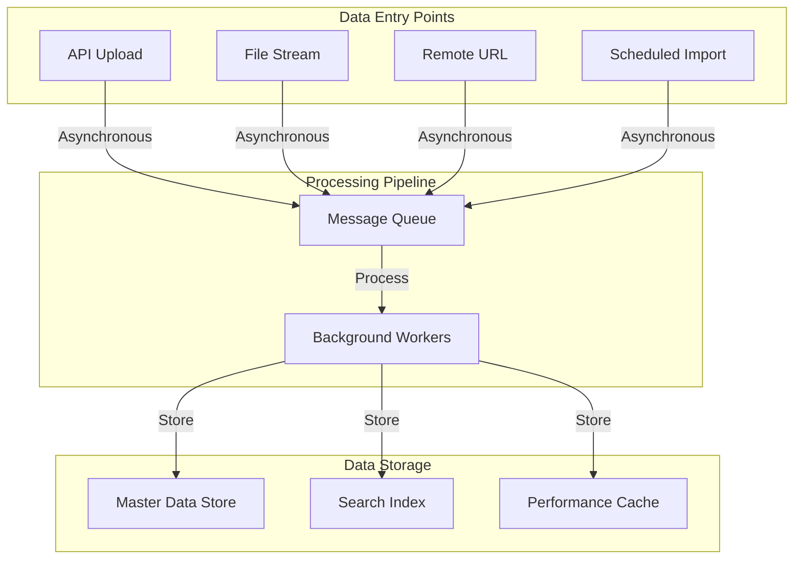
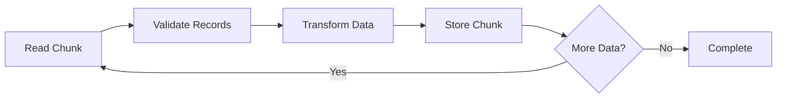

# Functional Specification: Scalable Offer Ingestion System

## 1. Executive Summary

This document outlines the functional requirements for a modern offer ingestion system designed to handle high-volume vehicle data imports. The system addresses the critical business need to process large datasets (170,000+ records) without system downtime, memory constraints, or operational bottlenecks.

The solution decouples data ingestion from core business operations, ensuring that bulk data loads do not impact system availability or user experience.

---

## 2. Business Objectives

### 2.1 Primary Goals

- **Eliminate System Downtime**: Enable bulk data imports without requiring system restarts or maintenance windows
- **Handle Scale**: Process datasets ranging from hundreds to hundreds of thousands of records efficiently
- **Ensure Data Integrity**: Maintain complete and accurate offer data throughout the ingestion process
- **Provide Operational Visibility**: Deliver clear monitoring and reporting on ingestion status and outcomes

### 2.2 Key Performance Indicators

- **Throughput**: Ability to process 170,000+ offers within acceptable timeframes
- **Memory Efficiency**: Process large files without system memory exhaustion
- **Fault Tolerance**: Continue operations even when individual records contain errors
- **Recovery Capability**: Resume processing after interruptions without data loss or duplication

---

## 3. System Architecture Overview

The ingestion system follows a **decoupled, asynchronous architecture** that separates concerns into distinct layers:



### 3.1 Architectural Principles

**Asynchronous Processing**
- Data entry and processing occur independently
- System accepts data immediately without waiting for processing completion
- Background workers handle the actual data transformation and storage

**Message-Based Communication**
- A message queue buffers incoming data between entry points and processing workers
- Enables the system to handle traffic spikes without overload
- Provides natural retry mechanisms for failed operations

**Independent Scaling**
- Each component (entry, processing, storage) can scale independently based on demand
- Additional workers can be deployed during peak ingestion periods
- No single bottleneck limits overall system capacity

---

## 4. Data Ingestion Modes

The system supports four distinct ingestion modes to accommodate different integration scenarios and data source types.

### 4.1 API Upload (Small to Medium Batches)

**Use Case**: Partners or internal systems submitting structured data programmatically

**Characteristics**:
- Accepts data in standard formats (JSON, XML)
- Suitable for regular, predictable data updates
- Typical batch size: up to 1,000 records
- Immediate acknowledgment upon receipt
- Ideal for real-time or near-real-time integrations

**Process Flow**:
1. Client sends data via HTTP API
2. System validates format and structure
3. Data is queued for processing
4. Client receives confirmation with tracking identifier
5. Background workers process asynchronously

---

### 4.2 Streaming Upload (Large Files)

**Use Case**: Processing very large files that cannot be loaded into memory at once

**Characteristics**:
- Handles files of any size (tested up to 2GB+)
- Processes data incrementally as it arrives
- Constant memory usage regardless of file size
- Suitable for monthly or quarterly bulk updates
- Supports both push (upload) and pull (download) models

**Process Flow**:
1. Client initiates file transfer
2. System reads data in small chunks (streaming)
3. Each chunk is immediately processed and queued
4. No complete file is ever held in memory
5. Progress can be monitored throughout the upload

**Key Benefit**: A 500MB file consumes the same memory as a 5MB file during processing

---

### 4.3 Remote URL Ingestion (Pull Model)

**Use Case**: Processing files hosted on partner systems or cloud storage

**Characteristics**:
- System retrieves data from external URLs
- Triggered on-demand or by schedule
- Supports authentication and secure protocols
- Useful for partners who cannot push data
- Reduces network infrastructure requirements

**Process Flow**:
1. Trigger initiated (manual or scheduled)
2. System connects to specified URL
3. Data is streamed directly from source
4. Processing occurs during download
5. Completion status reported

**Business Value**: Partners simply place files in their own infrastructure; our system pulls them automatically

---

### 4.4 Scheduled File System Monitoring (Automated)

**Use Case**: Automated processing of files deposited in monitored directories

**Characteristics**:
- Continuously watches designated folders
- Automatically detects new files
- Supports network file shares and secure file transfer locations
- Processes files based on naming conventions or metadata
- Archives or removes processed files

**Process Flow**:
1. Monitor detects new file in watched directory
2. System validates file is complete (not still being written)
3. File is locked for processing
4. Data is streamed and processed
5. File is moved to archive or deleted based on policy

**Operational Benefit**: Fully hands-off operation—drop files in a folder, system handles the rest

---

## 5. Asynchronous Processing Model

### 5.1 Why Asynchronous?

Traditional synchronous systems suffer from several critical limitations:

| Aspect | Synchronous (Legacy) | Asynchronous (Proposed) |
|--------|---------------------|------------------------|
| **User Experience** | Client waits for entire processing to complete | Immediate acknowledgment, processing in background |
| **System Load** | Processing blocks other operations | Main system remains responsive during ingestion |
| **Failure Impact** | Single error can halt entire import | Individual failures don't stop overall process |
| **Scalability** | Limited by processing capacity | Can queue unlimited work for gradual processing |

### 5.2 Message Queue Benefits

The message queue acts as a **shock absorber** between data entry and processing:

**Traffic Spike Management**
- When 170,000 offers arrive simultaneously, they queue safely
- Workers process at optimal sustainable rate
- No data loss, no system crashes

**Fault Tolerance**
- If processing fails, messages remain in queue
- Automatic retry mechanisms
- Failed messages can be inspected and reprocessed

**Auditability**
- Complete history of all ingestion events
- Ability to replay historical data if business logic changes
- Full traceability from source to final storage

---

## 6. Data Processing Workflow

### 6.1 Stream-Based Processing

The system employs **streaming** rather than **batch loading** techniques:

**Traditional Batch Approach** (Legacy):
```
1. Load entire file into memory
2. Parse complete file
3. Process all records
4. Save all results
```
*Problem*: A 500MB file requires 1.5GB+ of memory

**Streaming Approach** (Proposed):
```
1. Read small portion of file
2. Process that portion
3. Queue for storage
4. Repeat until file complete
```
*Benefit*: Constant memory usage (~256MB) regardless of file size

### 6.2 Chunked Processing Strategy

For maximum efficiency and recoverability, processing occurs in configurable chunks:

**Chunk Size**: Typically 100-500 records per chunk

**Advantages**:
- **Checkpointing**: Progress saved after each chunk
- **Restart Capability**: Failed jobs resume from last successful chunk
- **Performance**: Optimized database commits
- **Error Isolation**: Corrupt records don't invalidate entire file

**Process**:


---

## 7. Error Handling and Recovery

### 7.1 Fault Tolerance Strategies

**Skip Invalid Records**
- System can be configured to skip a defined number of malformed records
- Invalid records are logged with detailed error information
- Processing continues with valid data
- Business rule: Skip up to 0.5% of total records (configurable)

**Automatic Retry**
- Transient failures (network issues, temporary database unavailability) trigger automatic retries
- Configurable retry attempts and backoff intervals
- Persistent failures logged for manual review

**Partial Success Handling**
- If 95,000 of 100,000 records process successfully, those are committed
- Failed 5,000 records are isolated for correction and reprocessing
- No need to reprocess the entire dataset

### 7.2 Recovery Mechanisms

**Job Restart**
- Any interrupted job can be restarted from its last checkpoint
- No duplicate processing of successfully completed chunks
- Typical restart: continues within seconds from interruption point

**Data Replay**
- Historical message queue allows complete data replay
- Useful when business logic changes require reprocessing
- Example: New validation rule applied to last 6 months of data

---

## 8. Monitoring and Observability

### 8.1 Real-Time Visibility

The system provides comprehensive monitoring dashboards showing:

**Ingestion Metrics**
- Records received per hour/day
- Current queue depth
- Processing rate (records/second)
- Active worker count

**Job Status**
- Jobs in progress with completion percentage
- Recently completed jobs with success/failure counts
- Failed jobs requiring attention
- Average processing time trends

**Health Indicators**
- System memory usage
- Queue lag (time between arrival and processing)
- Error rates and types
- Storage capacity utilization

### 8.2 Alerting

Automated notifications trigger on:
- Processing failures exceeding threshold
- Queue depth growing beyond capacity
- Individual job failures
- Processing time exceeding SLA
- Data quality issues detected

---

## 9. Data Storage Strategy

### 9.1 Multi-Purpose Storage

The system employs **specialized storage** for different access patterns:

**Complete Data Repository**
- Stores full, detailed offer information
- Optimized for retrieval of individual vehicle details
- Flexible structure accommodates varying data formats
- Source of truth for all offer attributes

**Search Index**
- Optimized for fast filtering and searching
- Contains searchable fields only (make, model, price, location, etc.)
- Powers the user-facing search interface
- Denormalized for query performance

**Performance Cache**
- Frequently accessed data stored in high-speed cache
- Reduces load on primary databases
- Configurable expiration policies
- Automatic invalidation when source data changes

### 9.2 Update Strategy

**Upsert Logic**
- System identifies existing offers and updates them
- New offers are inserted
- Maintains data consistency across all storage layers

**Deduplication**
- Unique offer identifiers prevent duplicate entries
- Multiple ingestions of same data result in updates, not duplicates

---

## 10. Performance Characteristics

### 10.1 Expected Performance

Based on system design and capacity planning:

| Scenario | Volume | Processing Time | Memory Usage |
|----------|--------|----------------|--------------|
| Small batch API | 1,000 records | < 30 seconds | Minimal |
| Medium file upload | 10,000 records | 2-5 minutes | ~256MB |
| Large file stream | 100,000 records | 15-25 minutes | ~256MB |
| Massive bulk load | 170,000 records | 25-40 minutes | ~256MB |

**Note**: Processing time is worker-dependent; additional workers proportionally reduce time

### 10.2 Scalability

**Horizontal Scaling**
- Add workers to process faster during bulk loads
- Each worker operates independently
- Linear performance improvement with worker count

**Example**:
- 2 workers: 170,000 records in 30 minutes
- 4 workers: 170,000 records in 15 minutes
- 8 workers: 170,000 records in 8 minutes

---

## 11. Integration Scenarios

### 11.1 Partner Integration Patterns

**Pattern 1: Daily Automated Feed**
- Partner places file on SFTP server daily at 2 AM
- Scheduled monitor detects and processes automatically
- Results available by 3 AM
- Zero manual intervention required

**Pattern 2: Real-Time API Updates**
- Partner sends individual offer updates as they occur
- Immediate processing and availability
- Supports high-frequency trading scenarios

**Pattern 3: On-Demand Bulk Refresh**
- Monthly comprehensive data refresh
- Partner provides URL to large file
- System pulls and processes on trigger
- Progress monitored via dashboard

**Pattern 4: Hybrid Approach**
- Daily incremental updates via API
- Weekly full refresh via file upload
- Optimizes network usage and data freshness

---

## 12. Data Quality and Validation

### 12.1 Validation Layers

**Format Validation**
- Ensures data structure matches expected schema
- Rejects or flags improperly formatted records
- Supports both strict and lenient modes

**Business Rule Validation**
- Verifies required fields are present
- Checks data ranges (e.g., price > 0, year in valid range)
- Validates referential integrity (e.g., valid dealer codes)

**Duplicate Detection**
- Identifies potential duplicate offers
- Configurable matching rules
- Options: reject, flag for review, or auto-merge

### 12.2 Data Enrichment

During processing, the system can:
- Standardize formats (dates, currencies, units)
- Normalize text (trim whitespace, consistent casing)
- Calculate derived fields (age from year, price ranges)
- Add metadata (ingestion timestamp, source identifier)

---

## 13. Security and Compliance

### 13.1 Access Control

**Authentication**
- All API endpoints require authentication
- Token-based access for programmatic integrations
- Role-based permissions for manual operations

**Authorization**
- Partners can only access their own data
- Admin users have cross-partner visibility
- Audit logging of all access

### 13.2 Data Protection

**In Transit**
- All network communications encrypted
- Secure file transfer protocols supported
- Certificate-based authentication for sensitive integrations

**At Rest**
- Sensitive data encrypted in storage
- Configurable retention policies
- Secure deletion capabilities

---

## 14. Operational Procedures

### 14.1 Normal Operations

**Daily Routine**
- Monitor dashboard for job completion
- Review error logs for data quality issues
- Confirm expected data volumes received

**Weekly Routine**
- Review performance trends
- Adjust worker count based on load patterns
- Archive or purge old processing logs

### 14.2 Incident Response

**Processing Failure**
1. System automatically retries transient errors
2. Alert generated if failure persists
3. Operations team reviews error details
4. Failed chunk isolated and corrected
5. Job restarted from last checkpoint

**Data Quality Issue**
1. Validation flags problematic records
2. Business team reviews flagged data
3. Decision: accept, reject, or request correction from source
4. Corrections processed via standard ingestion flow

---

## 15. Future Extensibility

The system architecture supports future enhancements:

**Additional Data Sources**
- New ingestion modes can be added without affecting existing ones
- Support for additional file formats (CSV, Excel, proprietary formats)
- Real-time streaming from partner databases

**Enhanced Processing**
- Machine learning-based data quality checks
- Automated data cleansing and standardization
- Predictive analytics on ingestion patterns

**Advanced Features**
- Incremental updates (only changed records)
- Conditional processing rules
- Multi-tenant isolation for SaaS offerings

---

## 16. Success Criteria

The system will be considered successful when:

✓ Bulk imports of 170,000+ records complete without system restart
✓ Memory usage remains constant regardless of file size
✓ Failed jobs can be restarted without reprocessing completed data
✓ 99.9% of valid records processed successfully
✓ Processing time meets or exceeds performance targets
✓ Zero data loss during ingestion process
✓ Complete visibility into all ingestion operations

---

## 17. Glossary

**Asynchronous Processing**: Processing that occurs in the background, independent of the initial request

**Chunk**: A subset of records processed together as a unit

**Message Queue**: A buffer that holds work items between components

**Stream Processing**: Processing data incrementally as it arrives, rather than loading it all at once

**Upsert**: An operation that updates existing records or inserts new ones

**Worker**: A background process that performs data processing tasks

**Checkpoint**: A saved point in processing from which a job can be resumed

**Idempotent**: An operation that produces the same result whether executed once or multiple times