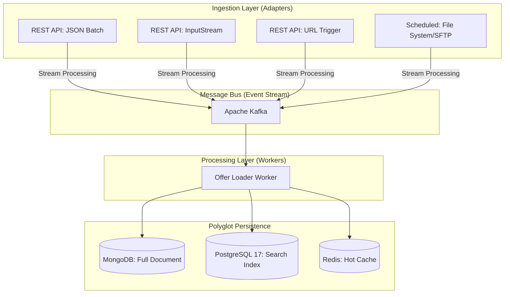
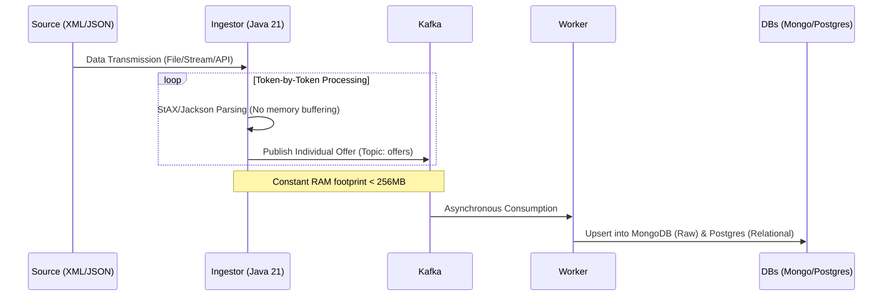
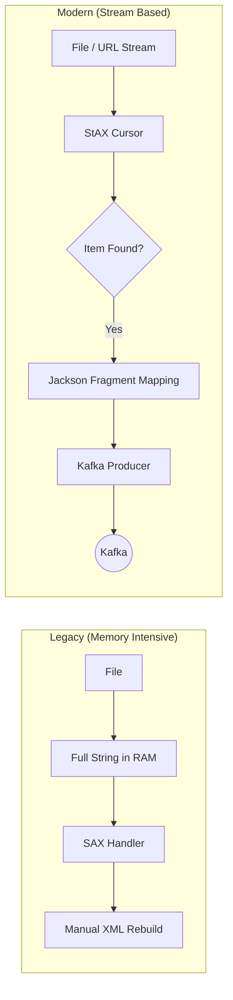
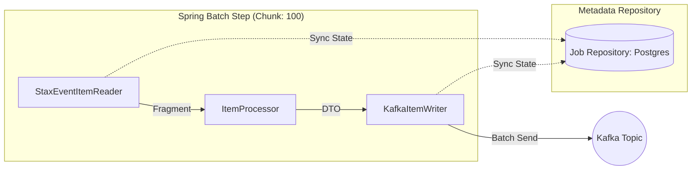

# Technical Proposal: Scalable Offer Ingestion System (SOIS)

## 1. Executive Summary

The primary objective of this proposal is to migrate the vehicle offer loading process from a memory-constrained monolith to a **dedicated, scalable ingestion microservice**. This system is designed to handle massive data volumes (exceeding 170,000 records) by leveraging event-driven architecture, reactive stream processing, and polyglot persistence.

---

## 2. Component Architecture

The solution fully decouples **data entry**, **message processing**, and **data persistence** to ensure high availability, fault tolerance, and independent scaling.



---

## 3. Data Flow (Sequence Diagram)

The system utilizes **Reactive Token-based Streaming** from the source. This ensures that RAM footprint remains constant regardless of whether the input file (XML or JSON) is 10MB or 2GB.



---

## 4. Architectural Decisions & Comparisons

### A. Messaging: Kafka vs. RabbitMQ

| Criterion     | RabbitMQ                               | Apache Kafka                          | Decision |
| ------------- | -------------------------------------- | ------------------------------------- | -------- |
| Persistence   | Messages are deleted after consumption | Immutable log (history preserved)     | Kafka    |
| Throughput    | May struggle with very large queues    | Ultra-fast sequential disk writes     | Kafka    |
| Replayability | Not possible                           | Allows rewinding to rebuild databases | Kafka    |

**Conclusion:** Kafka is chosen for its replayability (crucial for future logic changes) and its native ability to handle massive bursts of 170k+ messages without consuming excessive memory.

### B. Language: Java 21 vs. Others (Go / Python)

**Java 21 (Spring Boot 3.4)** introduces Virtual Threads (Project Loom), providing the concurrency performance of Go with the maturity of the Spring ecosystem.

**Decision:** Java 21 is selected to reuse existing domain models from the monolith and leverage high-performance streaming libraries such as StAX and Jackson.

### C. Database: MongoDB vs. PostgreSQL 17

| Database      | Role in Architecture      | Key Benefit                                                        |
| ------------- | ------------------------- | ------------------------------------------------------------------ |
| MongoDB       | Source of Truth (Details) | Stores full nested JSON/XML without rigid schema migrations        |
| PostgreSQL 17 | Read Model (Search)       | Optimized for indexed search fields and complex relational filters |

**Conclusion:** A polyglot persistence model is adopted. MongoDB powers the *Vehicle Detail Page*, while PostgreSQL drives the *Search Grid and Filters*.

---

## 5. Core Ingestion Functionalities

* **REST JSON (Batch):** Standard endpoint for small-to-medium integrations, adhering to standard Spring payload limits.
* **REST InputStream:** Accepts large files via POST by processing the byte stream directly from the network socket (`application/octet-stream`).
* **URL Pull:** Trigger-based endpoint where the service downloads and processes remote files on-the-fly using `WebClient`.
* **Scheduled Watcher:** Automatically scans local or network directories (e.g., SFTP mounts) for new files and processes them asynchronously.

---

## 6. Scalability & Performance Benefits

* **Constant Memory Footprint:** Token-based streaming enables processing of 2GB files with as little as 256MB of heap memory.
* **Horizontal Scalability:** Kafka partitions allow increasing the number of worker instances to drain ingestion queues rapidly during bulk loads.
* **Fault Isolation:** If downstream databases degrade or become unavailable, the ingestor continues operating at full speed while Kafka buffers events safely.
* **Asynchronous Decoupling:** The monolith is no longer blocked by heavy XML/JSON parsing during startup or update cycles.

---

## 7. Technical Evolution: From SAX to StAX (Memory Optimization)

### 7.1 The Bottleneck in the Legacy SAX Handler

The current implementation (`IngestionGenericXMLHandler`) uses a SAX parser. While SAX is event-driven, the existing logic introduces a significant memory bottleneck due to the following factors:

1. Conversion of the entire `byte[]` payload into a `String` prior to parsing.
2. Manual construction of `StringBuilder` instances for each XML tag.
3. Explicit management of a `Stack` to preserve XML hierarchy.

For an XML file of approximately 500MB, this approach can consume **more than 1.5GB of heap memory**, which directly explains the `OutOfMemoryError` currently observed in the monolithic application.

---

### 7.2 StAX: The Pull-Parser Advantage

In the proposed architecture, the ingestion logic migrates to **StAX (Streaming API for XML)** combined with **Jackson XML** for object mapping.

| Feature                | Legacy SAX Implementation             | New StAX + Jackson Approach               |
| ---------------------- | ------------------------------------- | ----------------------------------------- |
| **Memory Consumption** | Linear to file size                   | Constant (fixed footprint < 256MB)        |
| **Parsing Model**      | Push-based (events pushed to handler) | Pull-based (consumer requests next token) |
| **Object Mapping**     | Manual (`StringBuilder`, `Stack`)     | Automatic (`XmlMapper` to POJO)           |
| **Data Delivery**      | Deferred or manually triggered        | Immediate streaming to Kafka              |

This change fundamentally shifts parsing from a *buffered document model* to a *true streaming pipeline*.

---

### 7.3 Processing Logic Diagram

The ingestion flow evolves from a memory-heavy buffered model to a continuous, back-pressure-friendly streaming model.



---

### 7.4 Implementation Example (Java 21)

The following service replaces `IngestionGenericXMLHandler` by streaming XML fragments directly into Kafka without intermediate buffering.

```java
@Service
public class XmlStreamIngestor {

    private final KafkaTemplate<String, OfferDTO> kafkaTemplate;
    private final XmlMapper xmlMapper; // Jackson XML Module

    public void streamToKafka(InputStream xmlStream, String itemTag) throws Exception {
        XMLInputFactory factory = XMLInputFactory.newInstance();
        // Disable DTD processing for XXE protection
        factory.setProperty(XMLInputFactory.SUPPORT_DTD, false);
        
        XMLStreamReader reader = factory.createXMLStreamReader(xmlStream);

        while (reader.hasNext()) {
            int event = reader.next();
            
            // Locate the target <anuncio> (or equivalent) element
            if (event == XMLStreamConstants.START_ELEMENT
                && reader.getLocalName().equals(itemTag)) {
                
                // Deserialize only the current fragment into a DTO
                OfferDTO offer = xmlMapper.readValue(reader, OfferDTO.class);
                
                // Publish immediately to Kafka
                kafkaTemplate.send("offers-topic", offer.getMotorflashid(), offer);
            }
        }
    }
}
```

---

### 7.5 Conclusion

By migrating from SAX to StAX, the ingestion service completely eliminates `StringReader` and `StringBuilder` usage. XML is treated strictly as a byte stream, enabling the platform to process arbitrarily large files with a predictable and minimal memory footprint, fully aligned with the scalability objectives of the SOIS architecture.


# 8. Batch Processing & Resiliency with Spring Batch

## 8.1 Why Spring Batch for Large File Ingestion?
While a simple StAX stream is efficient for memory, **Spring Batch** adds a layer of robustness and operational control necessary for processing 170,000+ records. It transforms a "simple script" into a "managed job."

| Feature | Simple StAX Stream | Spring Batch + StAX |
| :--- | :--- | :--- |
| **Checkpointing** | If it fails, you must restart from byte 0. | Saves progress; restarts exactly where it failed. |
| **Chunking** | Processes 1 by 1. | Commits in chunks (e.g., 100 records) for better Kafka/DB performance. |
| **Skip Logic** | One malformed XML tag kills the whole process. | Can skip N invalid records, log them, and continue. |
| **Monitoring** | Basic logs. | Detailed metadata in DB (start time, end time, success count). |

## 8.2 The Chunk-Oriented Processing Model
Spring Batch divides the ingestion into three distinct phases: **Read**, **Process**, and **Write**.


## 8.3 Implementation Strategy (Java 21)

Using Spring Batch's native StaxEventItemReader ensures we maintain our low memory footprint while gaining job management features.
```java
@Bean
public Step xmlIngestionStep(JobRepository jobRepository, 
                             PlatformTransactionManager transactionManager) {
    return new StepBuilder("xmlIngestionStep", jobRepository)
        .<Anuncio, OfferDTO>chunk(100, transactionManager) // Grouping for throughput
        .reader(staxItemReader())        // Low-level XML Streaming
        .processor(offerProcessor())     // Mapping & Validation logic
        .writer(kafkaItemWriter())       // High-performance Kafka batching
        .faultTolerant()
        .skipLimit(100)                  // Resilience: skip up to 100 errors
        .skip(Exception.class)
        .build();
}
```

## 8.4 When to Use Spring Batch vs. Direct Stream

To optimize resources, the microservice will apply different strategies based on the input source:

**Direct Streaming (Point 7):**
Used for REST API (InputStream) where immediate response is required and the payload is managed by the client connection.

**Spring Batch (Point 8):**
Used for Scheduled Tasks and URL File Downloads. These are long-running background processes that require monitoring and the ability to resume after a crash.

## 8.5 Conclusion

Integrating Spring Batch ensures that the ingestion of 170,000 offers is observable and recoverable. It provides the business with clear metrics on ingestion success rates and ensures that system failures do not result in manual data cleanup or full reprocessing of large files.